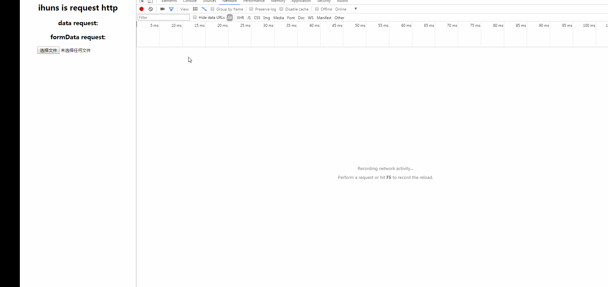

# ihuns
ihuns is http request libs

## Browser support

 |  |  |  |  |  |
--- | --- | --- | --- | --- | --- |
Latest ✔ | Latest ✔ | Latest ✔ | Latest ✔ | Latest ✔ | 9+ ✔ |

## install

npm install ihuns --save

or

```html
<script src="ihuns.js"></script>
```

## import

import ihuns from 'sendjs';

## Example

```js
//data request
new Ihuns({
  url: '/api',
  baseURL: 'http://192.168.9.86:8006',
  data: {},
  success: function success(res) {
    resolve(res);
  },
  error: function error(err) {
    reject(err);
  }
});
```

```js
//file request
new Ihuns({
  url: '/api',
  baseURL: 'http://192.168.9.86:8006',
  data: {},
  isFormData:true,
  success: function success(res) {
    resolve(res);
  },
  error: function error(err) {
    reject(err);
  }
});
```



```js
//file downClient
new Ihuns({
  url: '/api',
  baseURL: 'http://192.168.9.86:8006',
  data: {},
  isDownClient:true,
  success: function success(res) {
    resolve(res);
  },
  error: function error(err) {
    reject(err);
  }
});
```

[Example](https://github.com/wqb2017/ihuns/blob/master/example/index.js)

## use promise
```js
function createIhuns(url = '', data = {}) {
  return new Promise(function(resolve, reject) {
    new Ihuns({
      url: url,
      baseURL: 'http://192.168.9.86:8006',
      data: data,
      success: function success(res) {
        resolve(res);
      },
      error: function error(err) {
        reject(err);
      }
    });
  });
}
createIhuns('/partner/data', {
  module: 'portal',
  service: 'Portal',
  method: 'access',
  status: '',
  name: '',
  action: 'marketing.MaInfo.getMaInfoList'
}).then(res => {
  console.log(res);
}).catch(err=>{
  console.log(err);
})
```

## Config

```js
url: '', //request server url
method: 'get', //request method
baseURL: '', //server path
headers: {
  'Content-type': 'application/x-www-form-urlencoded; charset=utf-8'
}, //set headers
data: {}, //request params
timeout: null, //set timeout
async: true, //async
withCredentials: false, //Add withCredentials to request if needed
success: function() {}, //success fn
error: function() {}, //error fn
ontimeout: function() {}, //Handle timeout
isFormData: false, //file unload
isDownClient: false //file downClient
```

## response
```js
//success
let res = {
  response: {},//res
  status: 200,//status
  readyState: 4,//readyState
  config: {},//request config
}
//error
let err = (msg,xhr,config)
```

## format

* umd
* cjs
* iife

## License

[MIT](https://opensource.org/licenses/MIT)

Copyright (c) 2018-present, wangqibiao
